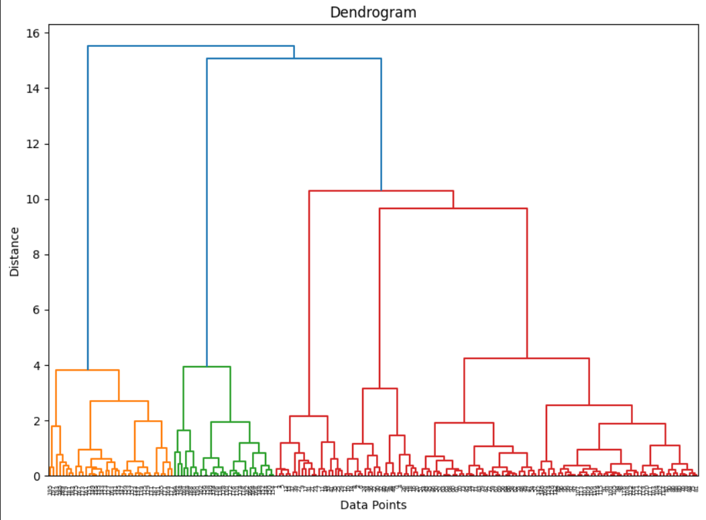

# Etc functions and method

`all` 함수 : 모든 조건이 True인지 확인

`count` 메서드 : Python의 리스트(List) 객체가 제공하는 내장 메서드. \
특정 값이 리스트에 몇 번 나타나는지 세어주는 기능

ex)&#x20;

<figure><figcaption></figcaption></figure>

```python
def solution(array, n):
    if 1 <= len(array) <= 100 and all(0 <= element <= 1000 for element in array) and 0 <= n <= 1000:
        return array.count(n)
```

`replace` : 문자열에서 특정 부분 문자열을 다른 문자열로 대체하는 Python의 문자열 메서드

```python
string.replace(old, new[, count]) 
```

* **`old`**: 교체하고 싶은 문자열(찾을 문자열).
* **`new`**: `old`를 대체할 문자열.
* **`count`** _(선택적)_: 교체를 수행할 최대 횟수. (생략하면 모든 `old`를 `new`로 교체)


